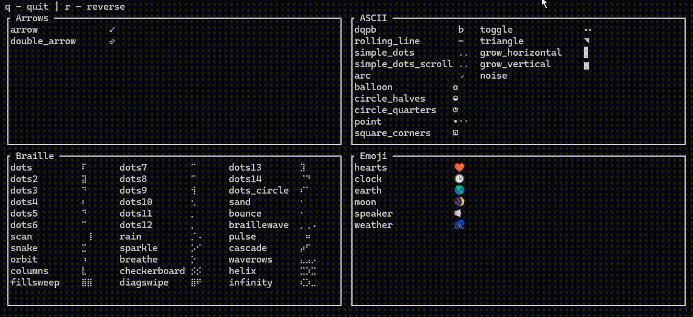

# 🌀 Zigspinner


A minimal terminal spinner library for Zig.

Zigspinner is inspired by Rust spinner crates and keeps spinner data compile-time friendly with a small runtime API.

## Features

- Timed spinners driven by elapsed time
- Ticked spinners for manual/frame-by-frame control
- Reverse direction toggle
- Offset and interval controls
- Preset categories:
  - arrows
  - ascii
  - braille
  - emoji
- Interactive showcase example

## Requirements

- Zig 0.15.2 or newer

## Quick Start

### Run locally

```bash
zig build
zig build test
zig build run
zig build run-no-std
zig build run-showcase
```

## Use As A Dependency

Add your package in another Zig project:

```bash
zig fetch --save git+https://github.com/Andrew-Velox/Zigspinner.git
```

In the consumer's build script, expose the module:

```zig
const dep = b.dependency("Zigspinner", .{});
const zigspinner_mod = dep.module("Zigspinner");

exe.root_module.addImport("Zigspinner", zigspinner_mod);
```

Then import in code:

```zig
const sp = @import("Zigspinner");
```

## Basic Usage

### Timed spinner (minimal)

```zig
const std = @import("std");
const sp = @import("Zigspinner");

pub fn main() !void {
    var spinner = sp.presets.ascii.simple_dots_scrolling();

    var stdout_buffer: [1024]u8 = undefined;
    var stdout_writer = std.fs.File.stdout().writer(&stdout_buffer);
    const out = &stdout_writer.interface;

    const start = std.time.nanoTimestamp();

    while (true) {
        const now = std.time.nanoTimestamp();
        const elapsed: u64 = @intCast(now - start);

        try out.print("\r{s}", .{spinner.frameAt(elapsed)});
        try out.flush();

        std.Thread.sleep(30_000_000);
    }
}
```

  ### Timed spinner (Unicode-safe on Windows)

  ```zig
  const std = @import("std");
  const builtin = @import("builtin");
  const sp = @import("Zigspinner");

  fn configureTerminalOutput() void {
    switch (builtin.os.tag) {
      .windows => {
        const win = std.os.windows;
        _ = win.kernel32.SetConsoleOutputCP(65001);
      },
      else => {},
    }
  }

  pub fn main() !void {
    configureTerminalOutput();

    var spinner = sp.presets.emoji.moon();

    var stdout_buffer: [1024]u8 = undefined;
    var stdout_writer = std.fs.File.stdout().writer(&stdout_buffer);
    const out = &stdout_writer.interface;

    const start = std.time.nanoTimestamp();

    while (true) {
      const now = std.time.nanoTimestamp();
      const elapsed: u64 = @intCast(now - start);

      try out.print("\r{s}", .{spinner.frameAt(elapsed)});
      try out.flush();

      std.Thread.sleep(30_000_000);
    }
  }
  ```

### Reverse direction

```zig
const forward = sp.presets.ascii.rolling_line();
const reversed = forward.reverse();
```

### Ticked spinner (manual)

```zig
var ticked = sp.presets.ascii.simple_dots().intoTicked();
_ = ticked.tick();
const frame = ticked.currentFrame();
_ = frame;
```

### No-std style driving (external clock)

```zig
const spinner = sp.presets.ascii.simple_dots_scrolling();
var elapsed_ns: u64 = 0;

for (0..8) |_| {
    _ = spinner.frameAt(elapsed_ns);
    elapsed_ns += spinner.interval();
}
```

## Define A Custom Spinner

```zig
const sp = @import("Zigspinner");

const MySpec = sp.SpinnerSpec(1, 1, 80_000_000, [_][]const []const u8{
    &[_][]const u8{"-"},
    &[_][]const u8{"\\"},
    &[_][]const u8{"|"},
    &[_][]const u8{"/"},
});

const MySpinner = sp.Timed(MySpec);

pub fn buildSpinner() MySpinner {
    return MySpinner.init();
}
```

## Presets Overview

- arrows:
  - arrow
  - double_arrow
- ascii:
  - dqpb
  - rolling_line
  - simple_dots
  - simple_dots_scrolling
  - arc
  - balloon
  - circle_halves
  - circle_quarters
  - point
  - square_corners
  - toggle
  - triangle
  - grow_horizontal
  - grow_vertical
  - noise
- braille:
  - dots, dots2 ... dots14
  - dots_circle
  - sand, bounce, wave, scan, rain
  - pulse, snake, sparkle, cascade, columns
  - orbit, breathe, waverows
  - checkerboard, helix, fillsweep, diagswipe, infinity
- emoji:
  - hearts
  - clock
  - earth
  - moon
  - speaker
  - weather

## Examples

- examples/no_std.zig: external clock and ticked usage
- examples/showcase.zig: full interactive panel showcase
  - q to quit
  - r to reverse direction

## API Surface

Main exports from src/root.zig:

- Size
- TimedSpinner
- TickedSpinner
- Timed(comptime Spec)
- Ticked(comptime Spec)
- SpinnerSpec(...)
- presets

## Notes For Windows Terminal

The bundled executables enable UTF-8 output on Windows automatically.
For your own app code, use `configureTerminalOutput()` when rendering Unicode-heavy presets (emoji/braille).

If Unicode still looks garbled:

- Use a Unicode-capable terminal font (for example Cascadia Mono or JetBrains Mono)
- Keep terminal encoding in UTF-8

## License

MIT
